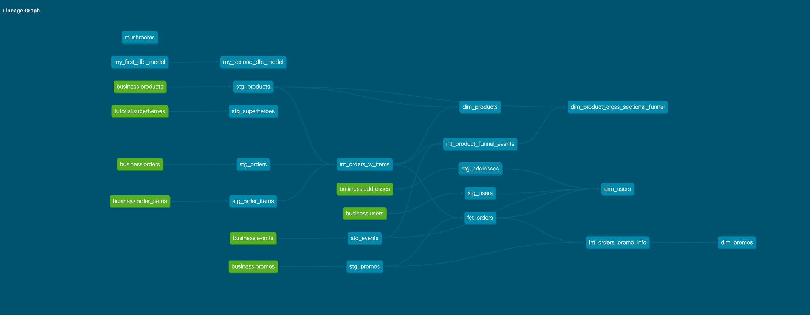

# Jerry Tsai is enjoying corise's dbt course

## Week 2 answers to questions

### Part 1: Models

#### (1) What is our user repeat rate?

80% ≈ 0.79838709677419354839
``` sql
SELECT 
  1.0 * SUM(CASE WHEN num_orders_ever >= 2 THEN 1 ELSE 0 END) / SUM(CASE WHEN num_orders_ever >= 1 THEN 1 ELSE 0 END) AS 
  repeat_rate
FROM 
  dbt_jerry_t.dim_users
;
```

#### (2) What are good indicators of a user who will likely purchase again? What about indicators of users who are likely NOT to purchase again? If you had more data, what features would you want to look into to answer this question?

A quick look at who our most frequent purchases are:

``` sql
SELECT 
  user_id
, SUM(CASE WHEN promo_id IS NOT NULL THEN 1 ELSE 0 END) AS 
  num_orders_w_promotions
, COUNT(1) AS 
  num_orders
FROM 
  dbt_jerry_t.int_orders_w_items
GROUP BY 1
ORDER BY 3 DESC
;
```
| user_id | num_orders_w_promotions    | num_orders |
|---------|----------------------------|------------|
| 6d37adeb-4c53-4167-b170-c89e4bd1764a | 6    | 22 |
| 96aa719e-c5a3-4645-ba89-16c304fb59b0 | 0    | 21 |
| 1fada2e4-1018-48f1-84dc-802dc99171fe | 3    | 21 |
| ... | ... | ... |

A quick examination to see if particular products or promotions might encourage people to purchase again:

``` sql
WITH
  user_product_stats AS
  (
  SELECT 
    user_id
  , product_id
  , product_name
  , SUM(CASE WHEN promo_id IS NOT NULL THEN 1 ELSE 0 END) AS 
    num_orders_w_promotions
  , COUNT(1) AS 
    num_orders
  FROM 
    dbt_jerry_t.int_orders_w_items
  GROUP BY 1,2,3
  )

SELECT
  product_id
, product_name
, COUNT(1) AS 
  num_users_who_ordered_more_than_once
, AVG(CASE WHEN num_orders_w_promotions > 0 THEN 1 ELSE 0 END) AS 
  probability_that_for_the_two_orders_there_was_at_least_one_promo
FROM
  user_product_stats
WHERE
  num_orders >= 2
GROUP BY 1,2
ORDER BY 3 DESC, 2 ASC
;
```
| product_id | product_name    | num_user_who_ordered_more_than_once | probability_that_for_the_two_orders_there_was_at_least_one_promo |
|--------------------------------------|---------------------|---|------|
| fb0e8be7-5ac4-4a76-a1fa-2cc4bf0b2d80 | String of pearls    | 7 | 0.29 |
| 74aeb414-e3dd-4e8a-beef-0fa45225214d | Arrow Head          | 6 | 0.00 |
| 58b575f2-2192-4a53-9d21-df9a0c14fc25 | Angel Wings Begonia | 5 | 0.20 |
| 689fb64e-a4a2-45c5-b9f2-480c2155624d | Bamboo              | 5 | 0.40 |
| ... | ...              | . | ... |

To properly investigate this question would take more time than I would like to spend at this moment. Of the data we have, we might explore whether:
  * where someone may live
  * the types of products they buy
  * the promotions offered
  * the cost of the items that are purchased
  * the time elapsed between when the order was placed and the products were delivered
  * whether we had inventory when the user viewed the product page

might influence the likelihood that a user will (or will not) purchase again. 

To get more insight into this question, there are a lot of data that could inform:
  * how satisfied are the users with their products?
  * what are the demographics of the users?
  * what did the users see when they were shopping?
  * what do our competitors charge for the same products?

#### (3) Explain the marts models you added. Why did you organize the models in the way you did?

* **Core**: I created some tables that were fundamentally useful across the organization. 
* **Marketing**: I took a marketing perspective. What tactics could marketing use to encourage purchases? I focused on the effect of promotions.
* **Product**: I took the perspective of product, although it could also be interpreted as marketing. I created funnel stats for each product, by which I mean: which products attracted the most page views, which products were most likely to be added to one's cart if viewed, and which products were most likely to be checked out if added?

#### (4) Paste in an image of your DAG from the docs.



### Part 2: Tests

#### (1) What assumptions are you making about each model? (i.e. why are you adding each test?)

I wrote 56 tests. They test various assumptions about the data, particularly the staging data on which all the other models are built. Some of the most important tests are: 
  * That the assumed primary keys are unique
  * That certain columns are never null
  * That referential integrity exists (i.e., that foreign keys in one table genuinely have a match in the source table)
  * That columns with a small set of possible values take on only those values (or NULL). This columns are often used in pivot tables or used to classify dashboards. A new value needs to be spotted or else we may fail to report on it.

For the data in the marts, the most interesting test I used was an `expression_is_true` test from `dbt_utils`. I used this to test whether the order cost could be derived from other information.

#### (2) Did you find any “bad” data as you added and ran tests on your models? How did you go about either cleaning the data in the dbt model or adjusting your assumptions/tests?

I didn't find any "bad" data. The data survived all of the 56 tests. These tests were chosen carefully; I genuinely wanted certain assumptions to be met so we could confidently seek inference from the queries we make. 

#### (3) Your stakeholders at Greenery want to understand the state of the data each day. Explain how you would ensure these tests are passing regularly and how you would alert stakeholders about bad data getting through.

The ideal would be to take a page out of Drizly's book and have a communication method (here, a Slack channel) that would receive automated posts when a test fails. This would allow the Data Team to become aware that an assumption has been violated and take steps to address the problem, whether that be to fix the data directly or inform (internal) customers that certain dashboards may report erroneously.


## Week 1 answers to questions

#### (1) How many users do we have?

130
``` sql
SELECT COUNT(1) FROM dbt_jerry_t.stg_users;
```

#### (2) On average, how many orders do we receive per hour?

7.5208333333333333

``` sql
SELECT
  AVG(count)
FROM
  (
  SELECT 
    DATE_TRUNC('hour', created_at) AS date_hour
  , COUNT(1) AS count
  FROM dbt_jerry_t.stg_orders
  GROUP BY 1
  ) AS order_count_by_hour
;
```

#### (3) On average, how long does an order take from being placed to being delivered?

3.891803278688524

``` sql
SELECT
  AVG(seconds_between_order_placed_and_delivery) / 60.0 / 60.0 / 24.0 AS avg_days_for_delivery
FROM
  (
  SELECT
    delivered_at
  , 1.0 * EXTRACT(EPOCH FROM (delivered_at - created_at)) AS seconds_between_order_placed_and_delivery
  FROM
    dbt_jerry_t.stg_orders
  WHERE
    delivered_at IS NOT NULL
  ) AS delivered_orders
;
```

#### (4) How many users have only made one purchase? Two purchases? Three+ purchases?

```
num_purchases_labeled  count
1                       25
2                       28
3+                      71
```

``` sql
SELECT
  num_purchases_labeled
, COUNT(1) AS count
FROM
  (
  SELECT
    user_id
  , CASE 
    WHEN COUNT(1)  = 1 THEN '1'
    WHEN COUNT(1)  = 2 THEN '2'
    WHEN COUNT(1) >= 3 THEN '3+'
    ELSE NULL 
    END AS 
    num_purchases_labeled
  , COUNT(1) AS num_purchases
  FROM
    dbt_jerry_t.stg_orders
  GROUP BY 
    user_id
  HAVING
    COUNT(1) >= 1
  ) AS users_w_at_least_one_purchase
GROUP BY 1
ORDER BY 1
;
```

#### (5) On average, how many unique sessions do we have per hour?

16.3275862068965517

``` sql
SELECT
  AVG(num_distinct_sessions) AS avg_num_unique_sessions_per_hour
FROM
  (
  SELECT
    date_hour
  , COUNT(1) AS num_distinct_sessions
  FROM
    (
    SELECT DISTINCT
      DATE_TRUNC('hour', created_at) AS date_hour
    , session_id
    FROM
      dbt_jerry_t.stg_events
    ) AS unique_sessions_in_each_date_hour
  GROUP BY 1
  ) AS num_unique_sessions_in_each_date_hour
;
```
